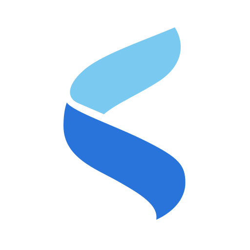
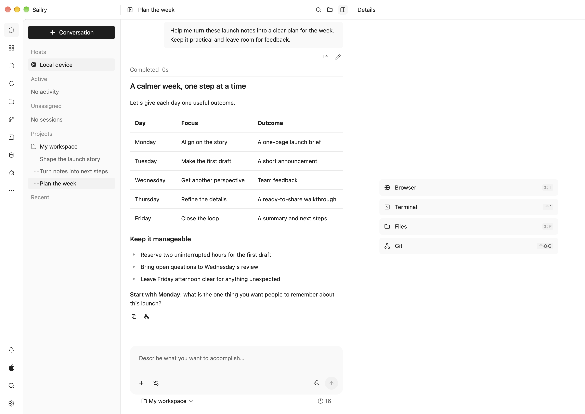
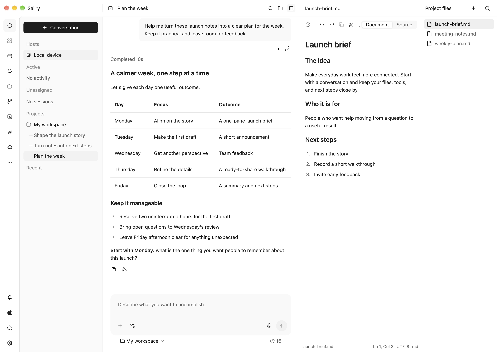
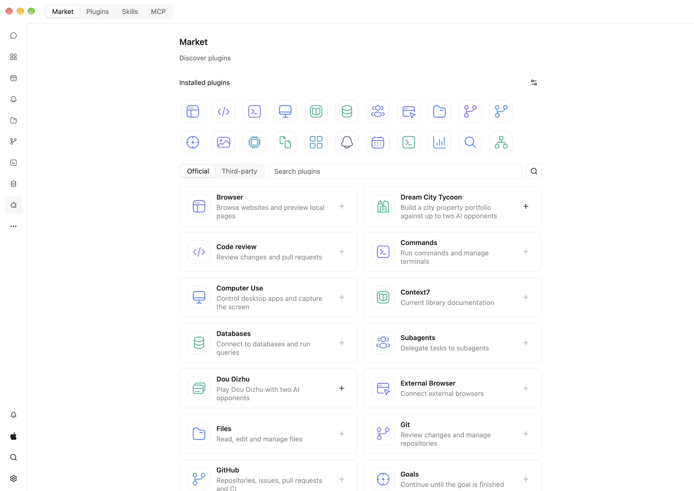

  

<h1 align="center">Sailry Harness</h1>

  English · <a href="README.zh-CN.md">Chinese (Simplified)</a>

<strong>A native, connected, plugin-first AI workspace</strong>

  Choose your models. Connect your computers. Make the workspace yours.

  <a href="https://github.com/sailry/sailry-harness/releases">Releases</a> ·
  <a href="CHANGELOG.md">What's new</a> ·
  <a href="https://github.com/sailry/sailry-harness/issues">Feedback</a>

Sailry Harness brings AI conversations, agents, and tools into one native
workspace. Use it for research, writing, documents, or software projects—with
your own model providers and a local or remote computer doing the work.

## What makes Sailry Harness different

- **Lightweight native desktop, not Electron.** A Rust application built with GPUI Kit and GPU-rendered native controls, avoiding a browser-based application shell
- **Connected workspaces.** Pair trusted computers and return to the same execution workspace, conversations, and session configuration—not a copied chat history
- **Plugin-first extensibility.** Plugins can add tools, native panels, dedicated assistants, and workspace controls; skills and MCP complement that system
- **Your choice of models.** Built-in choices cover 14 provider brands and services, with custom endpoints for four common API protocols
- **Work beyond chat.** Keep files, document previews, a browser, terminals, Git, SSH, and database assistants close to your conversations
- **An execution layer you control.** Run agents locally or on your own Sailry Host, choose tool permissions, and keep provider credentials on the execution Node

These capabilities are designed to work together: a native desktop workspace,
a shared execution layer, and plugins that extend both the tools and the interface.

## Connect once, continue where you left off

Desktop includes a local execution Node. Connect another computer running Sailry
Host when the files, environment, or long-running work belong elsewhere. Pairing
establishes trust, and remote connections use authenticated, encrypted transport.

Reconnecting resumes the same Node-owned workspace and effective session
settings. Disconnecting the controller does not stop admitted work, provided the
execution Node stays running. Local and remote work use the same command model.

A Flutter mobile controller connects directly to the selected Node without using
Desktop as a gateway. It is in development and is not currently distributed;
available desktop packages are listed under [Releases](https://github.com/sailry/sailry-harness/releases).

## Start with what you need

| Make sense of things | Create something useful | Work on a project |
| --- | --- | --- |
| Summarize notes, explore questions, and organize next steps | Shape a draft, prepare a brief, or work with documents | Browse files, review changes, and run tools alongside your conversation |

## Keep your work in view

Your projects and conversations stay on the left. Your current conversation sits
in the center. Open files and previews alongside it, so you can keep the context
close while you work.

## Plugins are more than tool connectors

Add capabilities from the official marketplace, or build your own. Plugins can
contribute agent tools, navigation entries, resource panels, embedded assistants,
composer actions, and context or statistics controls. Their desktop surfaces use
native GPUI Kit components—not a separate HTML interface.

Selected official plugins are bundled for offline installation. Installed plugins
can update independently of the application, through the same acquisition path
on local and remote Nodes. Skills supply reusable instructions; MCP connects
external tools. Neither replaces the richer workspace plugin system.

## Choose providers, not a single ecosystem

The current add-provider interface covers **14 provider brands and services**.
This counts OpenCode Go and Zen as one service family, not two vendors.

| Connection | Built-in choices |
| --- | --- |
| Core model services | OpenAI, Anthropic, Google Gemini |
| 10 additional hosted providers | xAI, DeepSeek, Qwen, Moonshot (Kimi), Mistral, MiniMax, Doubao, Zhipu, Baidu, Cohere |
| Multi-model services | OpenCode Go and OpenCode Zen |
| Custom-compatible endpoints | OpenAI Responses, OpenAI Chat Completions, Anthropic Messages, Gemini generateContent |

Use your own keys, configure a compatible gateway or local model endpoint, or use
ChatGPT sign-in where offered. DeepSeek has a dedicated adapter; OpenCode Go and
Zen route requests using the selected model's API. Model availability, reasoning,
media, and tool support depend on the provider and model you choose.

## Native foundations, modular by design

Rust and GPUI Kit power the desktop shell; ADK-Rust powers agent execution.
Execution, transport, shared client state, and presentation have separate owners,
so Desktop, Host, and Mobile share execution contracts rather than maintaining
separate agent engines. See the [architecture](ARCHITECTURE.md) for the boundaries.

Native rendering avoids running a browser-based shell for the whole application
interface. Embedded webviews are used for web content in browser panes, not to
render the application UI.

## Get started

Sailry Harness is in active development. Check [Releases](https://github.com/sailry/sailry-harness/releases)
for available macOS builds, distributed outside the Mac App Store.

1. Choose the macOS package for your Mac: Apple silicon or Intel
2. Unzip it and drag **Sailry.app** into **Applications**
3. Open Sailry and connect a model provider
4. Add a folder or start a conversation

Screenshots show a fresh English-language demo workspace with illustrative
conversations, not personal data or previous test sessions.

## Help shape Sailry Harness

Found a problem or have an idea? [Open an issue](https://github.com/sailry/sailry-harness/issues).
For changes to the application, start with the [contributing guide](CONTRIBUTING.md).

For contributors and plugin authors

- [Native setup and checks](CONTRIBUTING.md#native-setup)
- [Architecture](ARCHITECTURE.md)
- [Engineering rules](AGENTS.md)
- [Plugin SDK](sdk/plugins.md)
- [Official plugins](https://github.com/sailry/sailry-plugins)
- [Host and pairing](services/pairing-relay/README.md)

## Acknowledgements

Thanks to the open-source projects and their contributors that make Sailry
Harness possible, especially:

- [GPUI Kit](https://github.com/longbridge/gpui-kit) by Longbridge — desktop components, themes, and native plugin UI
- [GPUI](https://gpui.rs/) by the Zed team — GPU-accelerated desktop rendering
- [ADK-Rust](https://github.com/zavora-ai/adk-rust) — agent execution and model integrations
- [iroh](https://github.com/n0-computer/iroh) — encrypted connectivity between devices
- [Ghostty](https://github.com/ghostty-org/ghostty) — the embedded terminal renderer and shell integration
- [Wry](https://github.com/tauri-apps/wry) and GPUI Kit's WebView integration — embedded browser panes
- [rquickjs](https://github.com/DelSkayn/rquickjs) and [QuickJS](https://bellard.org/quickjs/) — headless plugin callbacks
- [Flutter](https://github.com/flutter/flutter) — the mobile controller

We also thank the maintainers of the other libraries, fonts, icons, and document
tools used here. Attribution and license notices remain in
[NOTICE](NOTICE), [third-party notices](third_party_licenses/), and `vendor/`.

## License

Sailry-owned code is licensed under [Apache-2.0](LICENSE). Third-party source,
resources and shell integration retain their own licenses and attribution; see
[NOTICE](NOTICE), [source notices](third_party_licenses/) and notices in `vendor/`.
Imported Ghostty shell integration includes GPL material and is not relicensed
by Sailry's Apache license.
